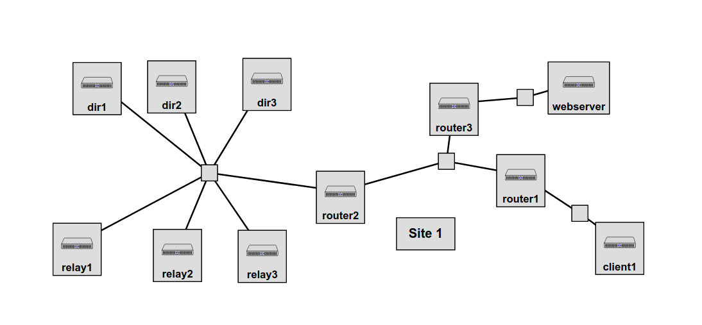

# Anonymous Routing of Network Traffic Using Tor

**Note**: This experiment is a modified version of [the blog post by Takuya Fukui](https://witestlab.poly.edu/blog/anonymous-routing-of-network-traffic-using-tor/) and on [the blog post by Bintia Keita](https://witestlab.poly.edu/blog/latency-tor/).

In this experiment, we will set up a private Tor network on GENI, and we'll see how Tor supports anonymous web browsing. This experiment will take approximately 60-90 minutes.

To reproduce this experiment on GENI, you will need an account on the [GENI Portal](http://groups.geni.net/geni/wiki/SignMeUp), and you will need to have [joined a project](http://groups.geni.net/geni/wiki/JoinAProject). You should have already [uploaded your SSH keys to the portal and know how to log in to a node with those keys](http://groups.geni.net/geni/wiki/HowTo/LoginToNodes). If you're not sure if you have those skills, you may want to try [Lab Zero](http://tinyurl.com/geni-labzero) first.

## Background

Tor is an anonymity network, used by people around the world to browse the Internet anonymously. When using Tor, network traffic is encrypted with multiple layers of encryption and routed through a sequence of Tor relays, which facilitates an anonymous connection between the source user and destination host. The source address is known to first Tor relay along the path (and to eavesdroppers on networks between the source and the first Tor relay), and the destination address is known to the last Tor relay along the path (and to eavesdroppers on networks between the last Tor relay and the destination). However, none of the Tor relays, destination hosts, or eavesdroppers on a single network can easily identify both source and destination address.

## Run my experiment

First, we need to reserve resources for the experiment. 


We will use the following topology, with three directory authority Tor nodes, three non-directory-authority Tor relay nodes, and as Tor client node. The topology also includes a web server, which we will visit directly and over the Tor network.




with IP addresses assigned to Tor nodes as follows:

* dir1: 10.10.1.1
* dir2: 10.10.1.2
* dir3: 10.10.1.3
* relay1: 10.10.1.11
* relay2: 10.10.1.12
* relay3: 10.10.1.13

The client node has IP address 10.10.201.1, and the webserver node has IP address 10.10.253.200.

In the GENI Portal, create a new slice and click "Add Resources". Then, load resources from the following URL: [https://raw.githubusercontent.com/ffund/tor-cloudlab/master/tor-portal-rspec.xml](https://raw.githubusercontent.com/ffund/tor-cloudlab/master/tor-portal-rspec.xml)

This topology uses many nodes, and your resource request is more likely to be successful if you select a site that has many available resources. Use [this monitor website](https://fedmon.fed4fire.eu/overview/instageni) to help you select an InstaGENI site. Then, click "Site 1", choose your selected site, and then click "Reserve Resources".

As these nodes boot up, they will follow a sequence of instructions in the RSpec that tells them to install Tor, set up cryptographic fingerprints, modify the Tor configuration file to include the fingerprints of all three directory authority nodes, and then restart Tor. This process takes a long time, especially because some nodes may not boot up as quickly as others. So at this point, you should walk away from your topology, and come back about 20-30 minutes later.


When you return, log in to the client node and verify that it is connected to the Tor network by running


```
sudo -u debian-tor nyx
```

Click the right arrow key on your keyboard to see the list of Tor connections and circuits. 

To exit `nyx`, type `q` and then type `q` again to confirm that you want to quit.


---

> **Note**: If you run `nyx` and get a long error message like the one below, it's because your terminal window is too small! Resize the window in which you're running `nyx` and try again.
```
Exception in thread Thread-6:
Traceback (most recent call last):
  File "/usr/lib/python3.6/threading.py", line 916, in _bootstrap_inner
    self.run()
  File "/usr/lib/python3.6/threading.py", line 864, in run
    self._target(*self._args, **self._kwargs)
  File "/usr/lib/python3/dist-packages/nyx/__init__.py", line 740, in halt_panels
    panel.join()
  File "/usr/lib/python3.6/threading.py", line 1051, in join
    raise RuntimeError("cannot join thread before it is started")
RuntimeError: cannot join thread before it is started

Traceback (most recent call last):
  File "/usr/bin/nyx", line 11, in <module>
    load_entry_point('nyx==2.0.4', 'console_scripts', 'nyx')()
  File "/usr/lib/python3/dist-packages/nyx/__init__.py", line 176, in main
    nyx.starter.main()
  File "/usr/lib/python3/dist-packages/stem/util/conf.py", line 289, in wrapped
    return func(*args, config = config, **kwargs)
  File "/usr/lib/python3/dist-packages/nyx/starter.py", line 118, in main
    nyx.curses.start(nyx.draw_loop, acs_support = config.get('acs_support', True), transparent_background = True, cursor = False)
  File "/usr/lib/python3/dist-packages/nyx/curses.py", line 217, in start
    curses.wrapper(_wrapper)
  File "/usr/lib/python3.6/curses/__init__.py", line 94, in wrapper
    return func(stdscr, *args, **kwds)
  File "/usr/lib/python3/dist-packages/nyx/curses.py", line 215, in _wrapper
    function()
  File "/usr/lib/python3/dist-packages/nyx/__init__.py", line 200, in draw_loop
    interface.redraw()
  File "/usr/lib/python3/dist-packages/nyx/__init__.py", line 716, in redraw
    panel.redraw(force = force, top = occupied)
  File "/usr/lib/python3/dist-packages/nyx/panel/__init__.py", line 175, in redraw
    self._last_draw_size = nyx.curses.draw(self._draw, top = self._top, height = self.get_height(), draw_if_resized = draw_dimension)
  File "/usr/lib/python3/dist-packages/nyx/curses.py", line 740, in draw
    curses_subwindow = CURSES_SCREEN.subwin(subwindow_height, subwindow_width, top, left)
_curses.error: curses function returned NULL
```

---


### Verify client anonymity

Next, we'll verify that the client is anonymous to the server when using Tor. 

We will use `tcpdump` to view network traffic while also saving packets to a file. On the webserver, run


```
sudo tcpdump -i eth1 'port 80' -U -w - | tee $(hostname -s)-http-no-tor.pcap | tcpdump -nnxxXSs 1514 -r - 
```

Then, in a second terminal on the web server node, run

```
sudo tail -f /var/log/apache2/access.log  
```

First, we will see how the client appears to the web server when it connects normally. On the client, run:

```
curl http://10.10.253.200/
```

Note the line that appears in the web server's access log, which includes the IP address from which this access appears. It should show the client's IP address. Run `ifconfig` on the client to verify that this address belongs to the client.

Use Ctrl+C to stop the `tcpdump` process, and then start a new one for the scenario with Tor:

```
sudo tcpdump -i eth1 'port 80' -U -w - | tee $(hostname -s)-http-with-tor.pcap | tcpdump -nnxxXSs 1514 -r - 
```

Then, access the webserver again from the client, but through the Tor network, and see how the client appears to 
the webserver this time:

```
curl --socks5-hostname 127.0.0.1:9050 http://10.10.253.200/
```

The new line that appears in the web server's access log, should *not* include any address that belongs to the client. Run `ifconfig` on each of the relay and directory authority nodes to identify the Tor node that this address belongs to.

Use Ctrl+C to stop the `tcpdump` process.


### Examine a Tor circuit

In the previous section, you identified the exit guard - the Tor relay at which traffic leaves the Tor network en route to its final destination. Between the client and the exit guard, this traffic traverses multiple hops, in order to preserve the client's anonymity.

To see how this works, we'll set up a longer-running stream using `iperf` over Tor. On the webserver node and the client node, run


```
sudo apt -y install iperf3
```


We are going to use the *carml* Python module to monitor Tor circuits. On the client node, run

```
sudo apt -y install python3-pip python3-humanize python3-click python-txtorcon
sudo -H -u debian-tor python3 -m pip install carml
```

Then, on the client node, run

```
sudo -H -u debian-tor python3 -m carml monitor
```

and leave it running. When you first run the carml monitor, it will show you a list of circuits (paths through the Tor network) and a numeric ID associated with each one:


```
No streams.
Current circuits:
  ID   | Age   | Path (router names, ~ means no Named flag) | State    | Purpose     
 ------+-------+--------------------------------------------+----------+------------
   262 | 37min | ~dir2->~dir1->~dir3                        | BUILT    | GENERAL     
   266 | 16min | ~dir1->~dir2->~relay3                      | BUILT    | GENERAL     
   267 | 16min | ~dir2->~dir1->~relay1                      | BUILT    | GENERAL     
   269 |  7min | ~dir1->~dir3->~dir2                        | BUILT    | GENERAL     
   270 |  7min | ~dir1->~dir2->~dir3                        | BUILT    | GENERAL     
   271 |  6min | ~dir3->~dir1->~dir2                        | BUILT    | GENERAL     
   272 |  6min | ~dir1->~relay1->~dir2                      | BUILT    | GENERAL     
   273 |  6min | ~relay1->~dir1->~dir2                      | BUILT    | GENERAL     
   274 |  6min | ~relay1->~dir1->~dir2                      | BUILT    | GENERAL     
   275 |  6min | ~dir1->~dir3->~relay1                      | BUILT    | GENERAL     
   276 |  6min | ~dir1->~dir2->~dir3                        | BUILT    | GENERAL     
   278 |  5min | ~dir1->~dir2->~relay1                      | BUILT    | GENERAL     
   279 |  5min | ~dir2->~dir3->~dir1                        | BUILT    | GENERAL     
   280 |  5min | ~dir1->~dir3->~dir2                        | BUILT    | GENERAL     
 ------+-------+--------------------------------------------+----------+------------
```

If you initiate a stream through the Tor network, it will tell you which circuit (by numeric ID) the stream is "attached" to, e.g. which circuit this stream flows through. It will also alert you as new circuits are built (with new numeric IDs) and as old circuits are removed.


With carml running, we are ready to start an `iperf` stream between client and webserver. On the webserver, run


```
iperf3 -s
```

and on another terminal on the client, run


```
proxychains iperf3 -c 10.10.253.200 -t 360
```

to send traffic to the server using `iperf` over Tor. We've set it to run for 360 seconds, but you can change that value if you need more time.

In a second terminal window on the client, run


```
sudo tcpdump -i eth1 -n src $(hostname -I | tr " " "\n" | grep "10.10") and greater 1400
```

(limiting our capture to large packets *from* the client node.) Identify the IP address of the Tor relay to which the bulk of this traffic is flowing. That node is the entry guard.

Next, open a terminal on the node that you idenfitied as entry guard, and repeat the `tcpdump`:

```
sudo tcpdump -i eth1 -n src $(hostname -I | tr " " "\n" | grep "10.10") and greater 1400
```

Identify the IP address of the Tor relay to which the bulk of traffic from the entry guard is flowing. That node is the middle guard.

Open a terminal on the node that you identified as the middle guard, and repeat the `tcpdump`:


```
sudo tcpdump -i eth1 -n src $(hostname -I | tr " " "\n" | grep "10.10") and greater 1400
```

Identify the IP address of the Tor relay to which the bulk of traffic from the middle guard is flowing. That node is the exit guard.


Finally, open a terminal on the node that you identified as the exit guard, and repeat the `tcpdump`:

```
sudo tcpdump -i eth1 -n src $(hostname -I | tr " " "\n" | grep "10.10") and greater 1400
```

You should see traffic flowing from the exit guard to the destination (the webserver). 

Review the `tcpdump` output you captured - does the path you identified match the circuit that carml told you your `iperf3` stream is attached to?


### Run a Tor hidden service

Tor can also be used to provide anonymity to the web service, not only to the client. To see how this works, we'll set up a "hidden service" - a web service protected by Tor - on the webserver.

On the webserver node, run

```
cd /local/repository
sudo bash client-fast-install.sh
```

to install Tor. Also install carml:


```
sudo apt -y install python3-pip python3-humanize python3-click python-txtorcon
sudo -H -u debian-tor python3 -m pip install carml
```


Then, run

```
sudo -u debian-tor mkdir /var/lib/tor/hidden_service
```

to create a hidden service configuration directory. 

Edit the Tor config file on the webserver with 

```
sudo nano /etc/tor/torrc
```

and add the following lines at the bottom:


```
HiddenServiceDir /var/lib/tor/hidden_service/http
HiddenServicePort 80 127.0.0.1:80
```

Use Ctrl+O to save the file (and Enter to confirm the filename) and then Ctrl+X to quit `nano`.  Finally, restart the Tor service on the webserver node with

```
sudo service tor restart
```

Now, if you run

```
sudo -u debian-tor cat /var/lib/tor/hidden_service/http/hostname
```

you'll get the name of your hidden service. This name is a 16-character hash derived from the service's public key,  can be used to access the service from any Tor client, without the client ever learning the service's true IP address. Here is how it works:

* The hidden service selects some Tor nodes as introduction points, and builds circuits to these introduction points. As long as these circuits are "alive", the introduction points are able to reach the hidden service.
* Then, the hidden service publishes a signed hidden service descriptor, which includes the service's public key and a list of introduction points. This descriptor is distributed throughout the Tor network.
* When a client wants to connect to the hidden service, it gets the hidden service descriptor from the Tor network, and learns the service's introduction points and public key.
* The client selects a Tor node to act as a rendezvous point, builds a circuit to the rendezvous point, and sends it a one-time secret.
* The client creates an Introduce message, which includes the address of the rendezvous point and the one-time secret. The client encrypts this message with the hidden service's public key, builds a Tor circuit to one of the introduction points, and sends the encrypted message to the introduction point over the Tor circuit, with instructions for it to be forwarded to the hidden service.
* The hidden service receives the encrypted Introduce message over the circuit that it had previously established with the introduction point. It decrypts the message and learns the one-time secret and the addres of the rendezvous point. 
* The hidden service creates a Rendezvous message containing the one-time secret. It builds a circuit to thethe rendezvous point and sends the message over this circuit.
* Now that both the client and the hidden service have connected to the rendezvous point (via separate circuits), they can to send traffic back and forth via the rendezvous point and their respective circuits to it.


Try this now - on both the client node and the webserver node, run


```
sudo -H -u debian-tor python3 -m carml monitor
```

to monitor circuits. 

On the webserver node, you will notice some circuits for purposes other than `GENERAL`. There will be many circuits for updating the hidden services directory information (`HS_SERVICE_HSDIR`). You should also be able to find some circuits that have been built between the hidden service and its introduction points (`HS_SERVICE_INTRO`). 


While the carml monitor is running on both the client and the webserver, on the client node, run

```
curl --socks5-hostname 127.0.0.1:9050 vfembklbr2dcm6ijofveng3iurpuzrguwhhhkqmgrvwjzmy7ji756zid.onion/file.txt
```

(substituting the name of *your own* hidden service, which you found earlier, in place of the last argument.)


The client will initially use a `HS_CLIENT_HSDIR` circuit to get the hidden service descriptor from the network. 
It will build a `HS_CLIENT_REND` circuit to a rendezvous point. Then, it will use a `HS_CLIENT_INTRO` circuit to send an Introduce message to the hidden service via an introduction point. When this message is forwarded to the service, it will build a `HS_SERVICE_REND` circuit to the rendezvous point. The client and service can then exchange messages and data using their respective rendezvous point circuits. 

**Note**: If there are too many `HS_SERVICE_HSDIR` circuits on the server to easily find the others, you can exclude these from the output. To see a list of circuits excluding the `HS_SERVICE_HSDIR` circuits, use

```
sudo -H -u debian-tor python3 -m carml monitor --once | grep -v "HS_SERVICE_HSDIR"
```
